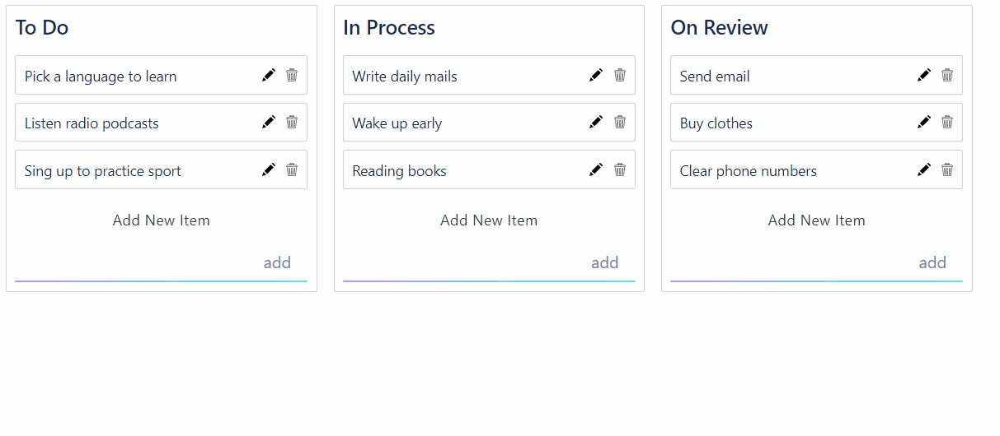

<h1 align="center">React Drag-and-Drop App</h1>

<h1 align="center">

[](https://ci.appveyor.com/project/VladimirOlishevsky/react-dnd)

</h1>



<h1 align="center"><a href="https://vladimirolishevsky.github.io/react-dnd/">Live Demo</a></h1>

## Description

Simple React App with ```react-beautiful-dnd``` (<a href="https://github.com/atlassian/react-beautiful-dnd">view</a>), ```React Styled Components``` and ```Redux Thunk```

## Where to begin:
- Clone the repository https://github.com/VladimirOlishevsky/react-dnd
- Set ```yarn``` dependencies
- Start a ```yarn start``` project.

## Working with the project:

You can move items freely both within a column and between columns. It is also possible to add a new element, edit or delete the current one. You can also save changes during editing or add an element by pressing the 'Enter' key
